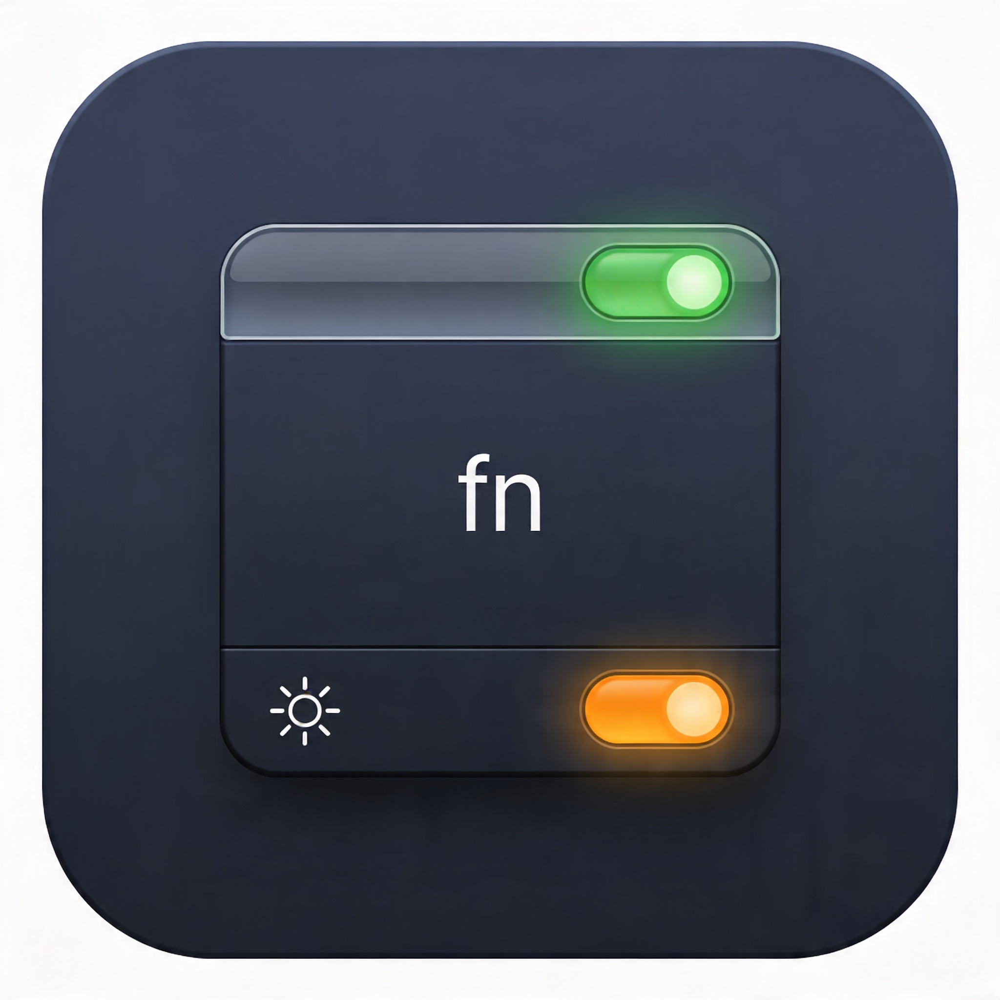

[한국어](README-kr.md) | [English](README.md)

# FnLamp

> macOS 메뉴바에서 fn키 모드를 한 번에 확인하고 전환하는 네이티브 앱



---

## 왜 만들었나

macOS 설정 앱에서 fn키 동작을 바꾸려면 **시스템 설정 → 키보드 → 키보드 단축키 → 기능 키** 순으로 여러 단계를 거쳐야 합니다. 게다가 현재 모드가 무엇인지 알려면 직접 키를 눌러 확인해야 했습니다.

FnLamp는 이 두 가지 불편을 없애줍니다.

---

## 주요 기능

| 기능 | 설명 |
|------|------|
| **메뉴바 표시등** | `fn` / 🌞 두 줄 LED로 현재 모드를 한눈에 표시 |
| **클릭 토글** | 메뉴바 아이콘을 좌클릭하면 즉시 모드 전환 |
| **전역 단축키** | 기본값 `⌃⌥⌘F`로 어디서든 모드 전환 |
| **단축키 커스터마이즈** | 우클릭 메뉴 → 단축키 설정에서 원하는 키 조합으로 변경 |
| **전환 알림 팝오버** | 모드 변경 시 1초간 결과를 메뉴바 아래에 표시 |
| **외부 변경 감지** | 설정 앱 등 다른 경로로 변경되어도 자동으로 표시등 동기화 |

### 메뉴바 표시등 읽는 법

```
fn  🟢   ← 표준 기능 키 모드 (F1, F2, F3 …)
🌞  ⚫
```

```
fn  ⚫   ← 특수 기능 키 모드 (밝기, 음량, 미디어 제어 …)
🌞  🟠
```

---

## 설치

> **안내**: 사전 빌드된 바이너리는 제공하지 않습니다.
> 본인의 macOS 및 Xcode 버전에 맞춰 직접 빌드해서 사용하세요.

### 요구 사항

- macOS 26 이상
- Xcode 26 이상

### 직접 빌드

```bash
git clone https://github.com/your-username/FnLamp.git
cd FnLamp
open FnLamp.xcodeproj
```

Xcode에서 **Product → Run** (`⌘R`) 또는 **Product → Archive**로 빌드합니다.

---

## 사용법

1. 앱을 실행하면 메뉴바에 표시등이 나타납니다 (Dock 아이콘 없음).
2. **좌클릭** → 즉시 fn 모드 전환
3. **우클릭** (또는 `⌃+좌클릭`) → 컨텍스트 메뉴
   - **fn 토글** (`T`) — 모드 전환
   - **상태 새로고침** (`R`) — 외부 변경 사항 즉시 반영
   - **단축키 설정…** — 전역 단축키 변경
   - **종료** (`Q`)
4. 전역 단축키 `⌃⌥⌘F` — 포커스와 무관하게 모드 전환

---

## 기술 스택

- **언어**: Swift 5
- **UI**: SwiftUI + AppKit (메뉴바 전용 accessory 앱)
- **단축키**: Carbon Event Manager (`RegisterEventHotKey`)
- **설정 적용**: `CFPreferences` + `activateSettings` 유틸리티로 즉시 반영

---

## 라이선스

MIT © 2026 Kyle Ahn — 자세한 내용은 [LICENSE](LICENSE) 참조
